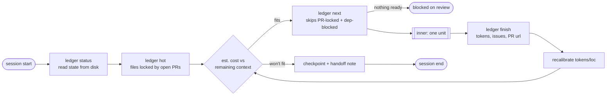
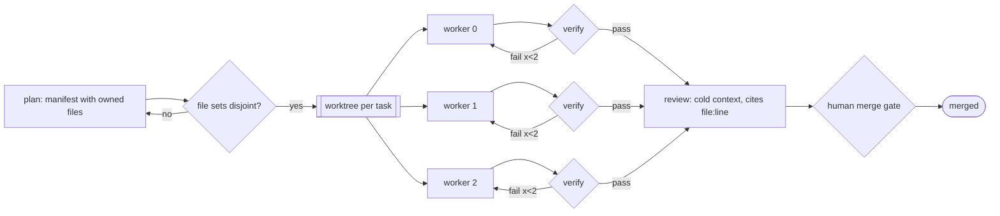
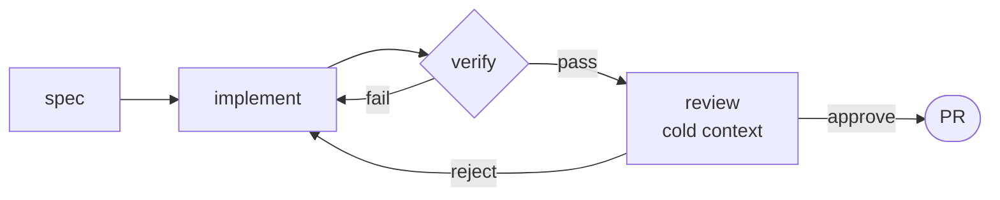
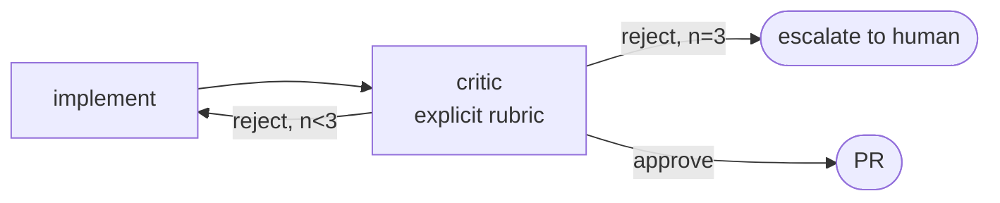

# Topology patterns

Copy the mermaid, adapt the labels. Don't invent a topology.

## 1. Campaign (multi-day, live repo) — the default for long-horizon work

Two nested graphs. Outer runs across sessions; inner processes one unit.

Inner loop: see `unit-workflow.md`.

## 2. Fan-out / fan-in — parallel, single session

Only when file ownership is provably disjoint. Verify that before drawing it.

## 3. Pipeline — serial, fresh context per stage

No parallelism gain. The win is that the reviewer never saw the implementer's
reasoning.

## 4. Adversarial pair

Cap the iterations or it argues about style forever.

## Choosing

- Units similar, work spans days, repo is live → **campaign**
- Units independent, one sitting, wall-clock matters → **fan-out**
- One unit, quality matters more than speed → **pipeline**
- Correctness is contested and checkable → **adversarial**
- None of the above → probably just a loop. Say so instead of drawing a graph.
