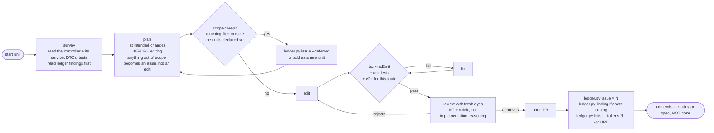

# Inner graph — processing one unit

Read this when you run `ledger.py start <id>`. It is separate from SKILL.md so it
isn't occupying context during orchestration.



## Survey

Read the ledger's findings first — they tell you what previous units discovered
about this codebase. Then read the controller, its service, its DTOs, and its
tests. Note the route count and whether e2e coverage exists before you touch
anything.

## Plan before editing

Write the intended change list out. This is the scope gate: anything not on the
list does not get edited. Refactoring campaigns die from scope creep more than
from any technical problem — you open one controller, notice the service layer
is a mess, and four hours later you're 900 lines into something unrelated with
no PR to show.

When you find something out of scope:
- small and unrelated → `ledger.py issue <unit> --severity X --text "..." --deferred`
- substantial → `ledger.py add <new-id> ...` so it gets its own unit and estimate
- affects how you'll do *later* units → `ledger.py finding --text "..."`

## Verify — NestJS specifics

The verifier is the ceiling on quality. For a Nest controller, minimum:

```bash
npx tsc --noEmit                       # DTO/decorator errors hide from tests
npm test -- <unit>.controller.spec      # unit
npm run test:e2e -- --testPathPattern <route>   # if e2e exists
```

If there is no e2e coverage for the routes you touched, say so explicitly in the
PR description. A refactor verified only by unit tests against mocks proves very
little about a controller — the interesting failures live in the pipes, guards,
and serialization layer that mocks skip past.

## Review with fresh eyes

The review must not be done by the context that wrote the code. Either spawn a
separate agent process with only the diff, or if you're doing this inline, at
minimum re-read the diff cold against the rubric rather than recalling intent.

Rubric:
1. Does every change appear on the plan from the Plan step?
2. Any file touched outside the unit's declared file set?
3. Route contract changes — path, method, status codes, response shape — that
   callers would notice? These are breaking changes; they need calling out.
4. Guards, interceptors, pipes, or decorators removed or reordered? Reordering
   a guard silently changes the security model.
5. Tests asserting on mocks only?
6. Anything in the diff that has no corresponding test?

Every objection cites file and line. An objection without a citation is noise.

## Close out

Log every issue found, even the ones you fixed — the tally is the deliverable.
Then record the real token cost and the PR url:

```bash
ledger.py finish <id> --tokens 47000 --pr https://github.com/org/repo/pull/123
```

The unit is now `pr-open`, which is not done. It becomes `merged` only when
`ledger.py sync` sees a real merge. Do not mark it yourself.
